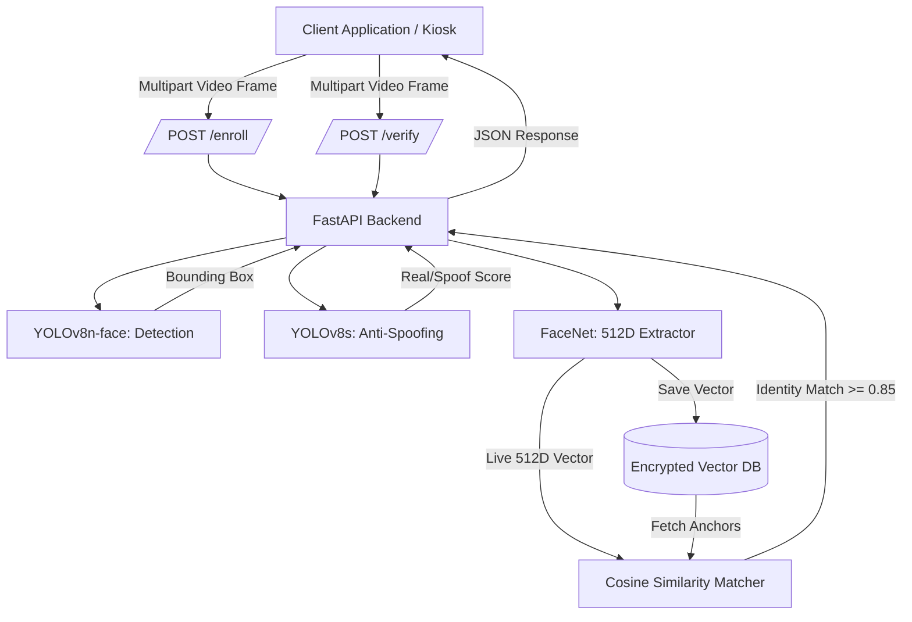

# AegisAuth API


Next-Gen Biometric Intelligence. An industry-grade, stateless Deep Learning Face Verification and Anti-Spoofing Microservice. 

This project goes beyond a simple script. It is a highly decoupled, real-time AI API designed to provide instant biometric authentication for educational examination portals, remote HR platforms, and physical attendance kiosks. 

---

## Why AegisAuth?

Traditional biometric systems suffer from two fatal flaws:
1. **The Retraining Bottleneck:** Whenever a new student or employee joins, the underlying classification model must be retrained to recognize the new face.
2. **The Spoofing Threat:** Standard models can be trivially bypassed by holding a printed photograph or a smartphone screen up to the webcam.

**AegisAuth solves both.** 
By transitioning to a **"One-Shot" Vector Embedding system**, users are instantly enrolled mathematically without ever retraining the AI. Simultaneously, a custom-trained **YOLOv8 Liveness Engine** analyzes the entire video frame for environmental context, successfully blocking digital and physical spoofing attacks in real time. 

---

## Core Capabilities & Competitive Edge

*   **Dynamic Liveness Detection (mAP50: 0.973):** Custom-trained on an enterprise Roboflow dataset to catch edge artifacts, screen glares, and planar depth issues common in spoof attacks. 
*   **One-Shot Enrollment:** Uses deep metric learning to compress human faces into 512-dimensional arrays. A user is registered in under 2 seconds.
*   **Zero-State REST Architecture:** Packaged as a FastAPI microservice, meaning it scales horizontally behind load balancers and integrates seamlessly into existing web apps via simple HTTP POST requests.
*   **Privacy-by-Design:** The system NEVER stores raw human faces post-enrollment. It only saves irreversible mathematical arrays, entirely neutralizing the threat of biometric data breaches.
*   **Sub-200ms Latency:** Bypasses disk I/O bottlenecks entirely by streaming and decoding video frames directly in system memory using OpenCV.

---

## The Deep Learning Pipeline

A single monolithic AI model is inefficient. AegisAuth utilizes an **Ensemble Architecture** consisting of three specialized neural networks running in parallel:

1.  **Face Localization (YOLOv8n-face):** A highly compressed nano-model that scans incoming HTTP streams to output precise facial bounding boxes in milliseconds.
2.  **Anti-Spoofing (YOLOv8s):** Rather than just looking at a cropped face (like ResNet), this model evaluates the *entire* frame to understand context. If confidence drops below `65%`, access is instantly denied.
3.  **Feature Extractor (FaceNet / InceptionResnetV1):** Crops the localized face, passes it through a pre-trained VGGFace2 architecture, and outputs a 512D vector. Verification happens by calculating the **Cosine Similarity** (requiring a strict $\ge 0.85$ match tolerance).

---

## System Architecture



---

## Complete Technology Stack

### Backend & Infrastructure
*   **FastAPI & Uvicorn:** For asynchronous, high-throughput REST API delivery.
*   **Pickle (.pkl):** Used as a lightweight, flat-file vector database for high-speed embedding retrieval.

### AI & Deep Learning
*   **PyTorch:** Core tensor manipulation and gradient computations.
*   **Ultralytics (YOLOv8):** Transfer learning and inference for object detection and liveness classification.
*   **FaceNet-PyTorch:** Implementation of the InceptionResnetV1 model for deep metric learning.

### Data Engineering & MLOps
*   **OpenCV (cv2) & NumPy:** For real-time memory-buffered image decoding and spatial tensor array transformations.
*   **Roboflow API:** Programmatic dataset ingestion for anti-spoofing training.
*   **Custom Python Tooling:** Built bespoke scripts (`undersample.py`, `check_class_imbalance.py`) to systematically identify and mitigate class imbalance biases prior to model training.

---

## API Documentation

Integrating AegisAuth into any frontend (React, Vue, or physical IoT devices) is incredibly simple. 

### 1. Register a New User
Instantly adds a user's mathematical signature to the database.
```http
POST /enroll
```
*   **Payload (FormData):** `file` (Image), `student_id` (String)
*   **Response:**
    ```json
    {
      "status": "success",
      "message": "User 12345 enrolled successfully",
      "liveness_score": 0.94
    }
    ```

### 2. Live Authentication
Streams a frame to the server to verify presence and identity.
```http
POST /verify
```
*   **Payload (FormData):** `file` (Image frame)
*   **Response:**
    ```json
    {
      "status": "Verified",
      "student_id": "12345",
      "liveness_score": 0.89,
      "bbox": [120, 80, 450, 410]
    }
    ```
    *(Note: `status` returns as `Verified`, `Unregistered`, or `Spoof Detected` based on the ensemble's decision).*

---

## Project Highlights

This project demonstrates:
*   **Applied AI Engineering:** This project integrates three distinct deep learning models into a cohesive, production-ready pipeline.
*   **Data Science Rigor:** Proactively solved severe dataset imbalances (preventing majority-class bias) using custom undersampling logic before initiating YOLOv8 training.
*   **Systems Architecture:** Designed as a stateless microservice. This means the AI engine can be Dockerized and scaled on AWS/GCP, or pushed entirely to the Edge (e.g., NVIDIA Jetson Nano).
*   **Cybersecurity & Compliance:** Demonstrated an understanding of modern data privacy. By irreversibly hashing user faces into vectors, the system inherently complies with GDPR/CCPA biometric storage regulations.

---

## Repository Structure

```text
aegisauth-api/
│
├── api/                          # Core FastAPI Microservice
│   ├── routers/                  # API Endpoints
│   │   ├── enroll.py             # `POST /enroll` — registers a new user (stores 512D vector)
│   │   └── verify.py             # `POST /verify` — verifies live frames against enrolled vectors
│   ├── liveness.py               # YOLOv8s Anti-Spoofing Logic
│   ├── services.py               # FaceNet Embedding & Pipeline Logic
│   └── main.py                   # API Application Initialization
│
├── database/                     # Privacy-First Storage
│   └── identities/               # Stores 512D Vector Embeddings (.pkl)
│
├── demo/                         # Client Simulation Scripts
│   ├── enrollment.py             # Registers a new user via webcam
│   └── live_verification.py      # Continuous anti-spoofing & auth test
│
├── models/                       # Deep Learning Weights
│   ├── liveness_engine/          # Custom YOLOv8s spoofing model weights
│   └── yolov8n-face.pt           # Nano Face Detection weights
│
├── trainLivenessModel/           # Training Liveness Model
│   ├── check_class_imbalance.py  # Data science analysis script
│   ├── getDataset.py             # Roboflow automated dataset ingestion
│   ├── undersample.py            # Bias mitigation script
│   └── train_on_colab.ipynb      # Jupyter Notebook for training
│
├── config.py                     # Centralized Configuration & Paths
├── main.py                       # Root execution script for Uvicorn
├── report.pdf                    # Project Report
├── requirements.txt              # Python dependencies
└── README.md                     # Project Documentation
```

---

## Quick Start

### 1. Installation
Clone the repository and install the strict dependencies:
```bash
git clone https://github.com/your-username/aegisauth-api.git
cd aegisauth-api
python -m venv venv
source venv/bin/activate  # On Windows: venv\Scripts\activate
pip install -r requirements.txt
```

### 2. Start the API Microservice
Instead of dealing with complex paths, simply run the root entry script:
```bash
python main.py
```
*The API will start running on `http://0.0.0.0:8000`.*

### 3. Run the UI Demo
Open a new terminal and run the provided OpenCV client scripts to test the API via your webcam:
```bash
# Register a face
python demo/enrollment.py

# Run real-time anti-spoofing and verification
python demo/live_verification.py
```

<br><br>

---
All Rights Reserved.