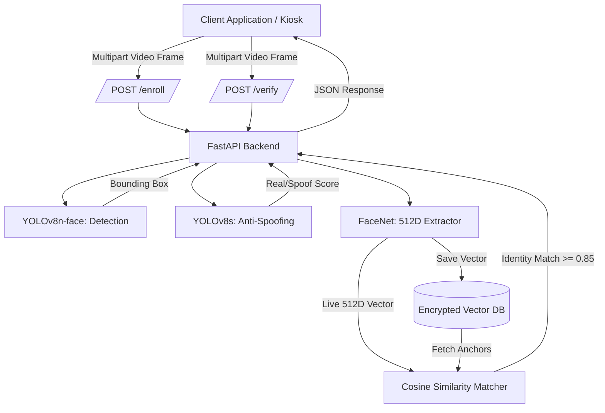
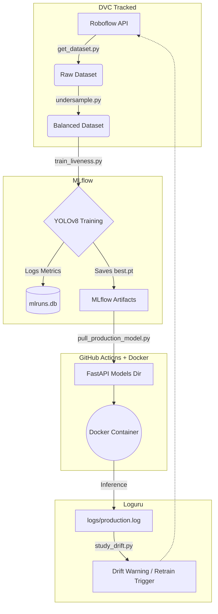

# AegisAuth API


**Next-Gen Biometric Intelligence powered by an Enterprise-Grade MLOps Architecture.** 

AegisAuth is an advanced, stateless Deep Learning Face Verification and Anti-Spoofing microservice. Beyond just training an AI, this project demonstrates a complete, production-ready **Machine Learning Operations (MLOps)** lifecycle—featuring data versioning, automated model registries, statistical drift monitoring, and stateless containerized deployment.

---

## Key Accomplishments

*   **Accomplished instant, zero-retraining user enrollment** as measured by sub-2-second registration times, by implementing a deep metric learning pipeline that extracts 512-dimensional facial vectors using a pre-trained InceptionResnetV1 (FaceNet) architecture.
*   **Accomplished highly resilient biometric security** as measured by an mAP50 score of 0.973 against presentation attacks, by custom-training a YOLOv8 liveness engine to analyze full-frame environmental context to block digital screen and printed photo spoofing.
*   **Accomplished absolute dataset and model reproducibility** as measured by a lightweight Git repository (avoiding massive binary commits), by orchestrating programmatic undersampling pipelines and securely tracking gigabytes of `.pt` weights via Data Version Control (DVC).
*   **Accomplished a fully auditable deep learning lifecycle** as measured by the automated transition of optimal model weights into a production Model Registry, by wrapping YOLOv8 training loops with MLflow to continuously log hyperparameters and SQLite telemetry.
*   **Accomplished zero-downtime deployment safety** as measured by sub-5-second automated cloud testing, by engineering a GitHub Actions CI/CD workflow that intelligently mocks heavy PyTorch GPU initializations during `pytest` executions via dynamic OS environment flags.
*   **Accomplished horizontally scalable inference and drift monitoring** as measured by a zero-state Dockerized REST API, by deploying the model ensemble via FastAPI and actively tracking statistical confidence degradation over time using `loguru` telemetry logs and bespoke data drift analysis scripts.

---

## Why AegisAuth?

Traditional biometric systems suffer from three fatal flaws:
1. **The Retraining Bottleneck:** Whenever a new user joins, the classification model must be retrained to recognize them.
2. **The Spoofing Threat:** Standard models can be trivially bypassed by holding a printed photograph or smartphone screen up to the webcam.
3. **"Shadow AI":** Engineers manually pass around massive `.pt` weight files, losing track of exactly which dataset trained which model version running in production.

**AegisAuth solves all three.** 
By utilizing a **"One-Shot" Vector Embedding system**, users are instantly enrolled mathematically without ever retraining the AI. A custom-trained **YOLOv8 Liveness Engine** evaluates the entire video frame to block spoofing attacks in real time. Finally, the entire system is governed by a strict **DVC + MLflow** pipeline, ensuring every model deployed to production is strictly version-controlled, reproducible, and tracked.

---

## Core AI Capabilities & Competitive Edge

*   **Dynamic Liveness Detection:** Custom-trained on an enterprise dataset to catch edge artifacts, screen glares, and planar depth issues common in spoof attacks. 
*   **One-Shot Enrollment (Deep Metric Learning):** Crops localized faces and passes them through a pre-trained VGGFace2 architecture (InceptionResnetV1), compressing human faces into 512-dimensional arrays in under 2 seconds. Verification happens via Cosine Similarity (requiring a $\ge 0.85$ match tolerance).
*   **Privacy-by-Design:** The system NEVER stores raw human faces post-enrollment. It only saves irreversible mathematical arrays into a lightweight vector `.pkl` database.
*   **Sub-200ms Latency:** Bypasses disk I/O bottlenecks by streaming and decoding video frames directly in system memory using OpenCV.

---

## The Deep Learning Pipeline

A single monolithic AI model is inefficient. AegisAuth utilizes an **Ensemble Architecture** consisting of three specialized neural networks running in parallel:

1.  **Face Localization (YOLOv8n-face):** A highly compressed nano-model that scans incoming HTTP streams to output precise facial bounding boxes in milliseconds.
2.  **Anti-Spoofing (YOLOv8s):** Rather than just looking at a cropped face (like ResNet), this model evaluates the *entire* frame to understand context. If confidence drops below `65%`, access is instantly denied.
3.  **Feature Extractor (FaceNet / InceptionResnetV1):** Crops the localized face, passes it through a pre-trained VGGFace2 architecture, and outputs a 512D vector. Verification happens by calculating the **Cosine Similarity** (requiring a strict $\ge 0.85$ match tolerance).

---

## Enterprise MLOps Infrastructure

This project is built to scale in a real-world software engineering environment. 

1. **Data Version Control (DVC):** Gigabytes of deep learning weights and anti-spoofing datasets are tracked via lightweight `.dvc` pointer files. This keeps the repositories extremely small and fast, while mathematically guaranteeing that a specific Git commit perfectly aligns with a specific dataset version.
2. **Experiment Tracking & Model Registry (MLflow):** The `train_liveness.py` loop is wrapped in MLflow. Every hyperparameter, epoch loss, and mAP score is tracked in a local SQLite database (`mlruns.db`). The optimal weights (`best.pt`) are automatically logged and injected into the MLflow Model Registry for production deployment.
3. **Continuous Integration & Deployment (CI/CD):** A GitHub Actions workflow (`ci.yml`) automatically provisions a cloud runner upon every Git push. It installs dependencies and executes a `pytest` suite. To prevent heavy PyTorch initialization from crashing the cloud runner, the API detects the CI environment (`TESTING=True`) and intelligently mocks the AI models.
4. **Containerization (Docker):** The entire FastAPI ecosystem and complex system dependencies (like OpenCV's `libgl1`) are containerized via a custom `Dockerfile`, ensuring it runs identically on a developer's laptop, an AWS cluster, or an edge device.
5. **Telemetry & Data Drift Monitoring:** Every inference request is logged to `logs/production.log` via the `loguru` library. A dedicated statistical analysis script (`study_drift.py`) continuously compares historical liveness confidence scores against recent inferences, automatically flagging a "Data Drift Warning" if environmental shifts (e.g., new webcam hardware) degrade model performance by >5%.

---


## System Architecture (API)


```mermaid
flowchart TD
    U[Client Application / Kiosk]
    API[FastAPI Backend]
    
    ENROLL[/POST /enroll/]
    VERIFY[/POST /verify/]

    YOLOn[YOLOv8n-face: Detection]
    YOLOs[YOLOv8s: Anti-Spoofing]
    FACENET[FaceNet: 512D Extractor]
    
    MATCH[Cosine Similarity Matcher]
    DB[(Encrypted Vector DB)]

    U -->|Multipart Video Frame| ENROLL
    U -->|Multipart Video Frame| VERIFY
    
    ENROLL --> API
    VERIFY --> API

    API --> YOLOn
    API --> YOLOs
    API --> FACENET
    
    YOLOn -- Bounding Box --> API
    YOLOs -- Real/Spoof Score --> API
    
    FACENET -- Live 512D Vector --> MATCH
    DB -- Fetch Anchors --> MATCH
    FACENET -- Save Vector --> DB
    
    MATCH -- Identity Match >= 0.85 --> API
    
    API -- JSON Response --> U
```

## The MLOps Lifecycle


```mermaid
flowchart TD
    subgraph 1. Data Pipeline [DVC Tracked]
        A[Roboflow API] -->|get_dataset.py| B(Raw Dataset)
        B -->|undersample.py| C(Balanced Dataset)
    end

    subgraph 2. Experiment Tracking [MLflow]
        C -->|train_liveness.py| D{YOLOv8 Training}
        D -->|Logs Metrics| E[(mlruns.db)]
        D -->|Saves best.pt| F[MLflow Artifacts]
    end

    subgraph 3. CI/CD & Deployment [GitHub Actions + Docker]
        F -->|pull_production_model.py| G[FastAPI Models Dir]
        G --> H((Docker Container))
    end
    
    subgraph 4. Telemetry [Loguru]
        H -->|Inference| I[logs/production.log]
        I -->|study_drift.py| J[Drift Warning / Retrain Trigger]
        J -.-> A
    end
```

---

## Complete Technology Stack

### Backend & Infrastructure
*   **FastAPI & Uvicorn:** For asynchronous, high-throughput REST API delivery.
*   **Docker:** For stateless, reproducible, and isolated microservice containerization.
*   **Pickle (.pkl):** Used as a lightweight, flat-file vector database for high-speed embedding retrieval.

### AI & Deep Learning
*   **PyTorch:** Core tensor manipulation and gradient computations.
*   **Ultralytics (YOLOv8):** Transfer learning and inference for object detection and liveness classification.
*   **FaceNet-PyTorch:** Implementation of the InceptionResnetV1 model for deep metric learning.

### Data Engineering & MLOps
*   **OpenCV (cv2) & NumPy:** For real-time memory-buffered image decoding and spatial tensor array transformations.
*   **Roboflow API:** Programmatic dataset ingestion for anti-spoofing training.
*   **DVC & MLflow:** For automated Data Versioning and Experiment Tracking / Model Registry.
*   **GitHub Actions:** For automated CI/CD Pytest pipelines.

---

## API Documentation

Integrating AegisAuth into any frontend (React, Vue, or physical IoT devices) is incredibly simple. 

### 1. Register a New User
Instantly adds a user's mathematical signature to the database.
```http
POST /enroll
```
*   **Payload (FormData):** `file` (Image), `student_id` (String)
*   **Response:**
    ```json
    {
      "status": "success",
      "message": "User 12345 enrolled successfully",
      "liveness_score": 0.94
    }
    ```

### 2. Live Authentication
Streams a frame to the server to verify presence and identity.
```http
POST /verify
```
*   **Payload (FormData):** `file` (Image frame)
*   **Response:**
    ```json
    {
      "status": "Verified",
      "student_id": "12345",
      "liveness_score": 0.89,
      "bbox": [120, 80, 450, 410]
    }
    ```
    *(Note: `status` returns as `Verified`, `Unregistered`, or `Spoof Detected` based on the ensemble's decision).*

---

## Project Highlights

This project demonstrates a cutting-edge integration of advanced Deep Learning with robust MLOps practices:
*   **Applied AI Engineering:** Integrates three distinct deep learning models (YOLOv8n, YOLOv8s, FaceNet) into a cohesive, highly accurate, real-time biometric pipeline.
*   **Data Science Rigor:** Proactively solved severe dataset imbalances (preventing majority-class bias) using custom programmatic undersampling logic before initiating YOLOv8 training.
*   **Enterprise MLOps Automation:** Orchestrated the entire model lifecycle using DVC for mathematical data versioning, MLflow for experiment tracking and Model Registry, and GitHub Actions for CI/CD automated testing.
*   **Systems Architecture & Deployment:** Designed as a stateless microservice and completely containerized via Docker. This ensures the AI engine can be seamlessly horizontally scaled on AWS/GCP, or pushed entirely to the Edge (e.g., NVIDIA Jetson Nano).
*   **Cybersecurity & Compliance:** Demonstrated an understanding of modern data privacy. By irreversibly hashing user faces into `.pkl` vectors, the system inherently complies with GDPR/CCPA biometric storage regulations.

---

## Repository Structure

```text
aegisauth-api/
│
├── .dvc/                              # DVC configuration mapping
├── .github/workflows/                 # CI/CD pipelines (Pytest & Docker build)
│   └── ci.yml
│
├── api/                               # Core FastAPI Microservice
│   ├── routers/                       # API Endpoints
│   │   ├── enroll.py                  
│   │   └── verify.py                  
│   ├── liveness.py                    # YOLOv8s Anti-Spoofing logic
│   ├── services.py                    # PyTorch device routing & FaceNet extraction
│   └── main.py                        # FastAPI Initialization
│
├── demo/                              # Client Simulators
│   ├── enrollment.py
│   ├── enrollment.html
│   ├── live_verification.py           
│   └── live_verification.html         
│
├── scripts/                           # MLOps Deployment & Drift Scripts
│   ├── pull_production_model.py       # Bridges MLflow Registry -> FastAPI deployment
│   └── study_drift.py                 # Statistical AI degradation monitor
│
├── tests/                             # Automated Test Suite
│   └── test_api.py                    # Pytest configuration
│
├── train/                             # Dataset and training logic
│   ├── check_class_imbalance.py       # Data science analysis script
│   ├── get_dataset.py                 # DVC Data Ingestion
│   ├── train_liveness.py              # MLflow YOLOv8 Training Loop
│   └── undersample.py                 # Bias mitigation script
│
├── .dockerignore                      # Docker exclusions
├── .dvcignore                         # DVC exclusions
├── .gitignore                         # Git exclusions (blocks heavy models & DB)
├── Dockerfile                         # Container architecture instructions
├── LICENSE.txt
├── README.md                          # Project Documentation
├── config.py                          # Global configuration paths
├── dvc.yaml                           # DVC pipeline orchestration
├── main.py                            # Uvicorn ASGI Entrypoint
├── models.dvc                         # DVC pointer linking to .pt weights
└── requirements.txt                   # Dependency list
```

---

## Quick Start Guide

### 1. With Docker
The easiest way to run the API without installing complex ML dependencies on your local machine:
```bash
# Build the stateless image
docker build -t aegisauth-api:latest .

# Run the container, exposing port 8000
docker run -p 8000:8000 aegisauth-api:latest
```

### 2. With Python (for Developers)
If you want to actively develop or retrain the models:
```bash
# 1. Clone & Setup Environment
git clone https://github.com/JNKODITHUWAKKU/AegisAuth-API.git
cd aegisauth-api
python -m venv venv
source venv/bin/activate
pip install -r requirements.txt

# 2. Pull DVC Weights (Requires DVC configured)
dvc pull

# 3. Start the API Microservice
python main.py
```
*The API will start running on `http://0.0.0.0:8000`.*


```bash
# 1. Obtain data for retraining
dvc repro

# 2. Retrain the custom model
python train/train_liveness.py

# Send best model to production
!python scripts/pull_production_model.py
```

### 3. Test the Application
Open a new terminal and run the provided OpenCV client scripts to test the API via your webcam:
```bash
# Register your face mathematically
python demo/enrollment.py

# Run real-time anti-spoofing and verification
python demo/live_verification.py
```


<br><br>

---
All Rights Reserved.