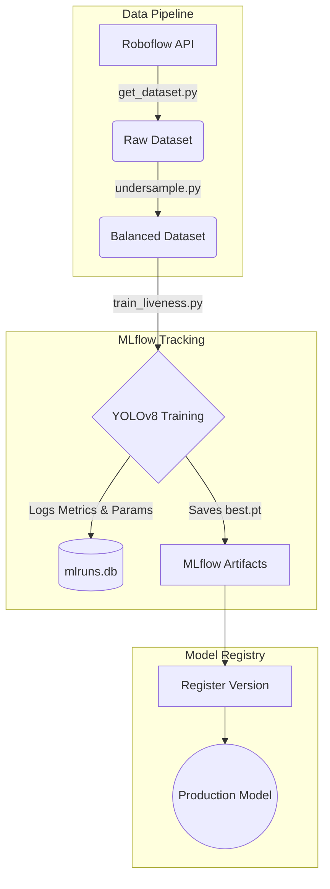

# Coursework 2 - Machine Learning 2

- MLOps for AegisAuth API by COHNDDS251F-001,002,003
- Github Link : https://github.com/JNKODITHUWAKKU/AegisAuth-API

## 1. Problem Definition

### 1.1 The MLOps Problem
Deploying a deep learning application like AegisAuth (a biometric face verification and anti-spoofing API) involves much more than simply writing a Python script and training a model. Traditionally, manual deployments suffer from "shadow AI"—where engineers lose track of which dataset trained which model, and which model version is currently running in production. Furthermore, manually testing the FastAPI endpoints and containerizing the application for every update is error-prone and time-consuming. 

The core problem this project solves is transforming a fragmented, manual deep learning script into a cohesive, automated **MLOps Pipeline**. This ensures absolute reproducibility, strict version control, automated testing, and continuous monitoring of the AI model in a production environment.

### 1.2 Assumptions and Limitations
*   **Infrastructure Assumptions:** It is assumed that the Continuous Integration (CI) pipeline runs on standard cloud runners (e.g., GitHub Actions Ubuntu environments) which lack dedicated GPUs. Therefore, the testing suite assumes a CPU-only environment.
*   **Storage Limitations:** Enterprise cloud storage (e.g., AWS S3) is assumed to be unavailable for this coursework. Consequently, Data Version Control (DVC) is configured to manage data locally or via synchronized cloud drives (like Google Drive) rather than a remote bucket.
*   **Architectural Assumptions:** The system assumes a stateless REST API architecture, meaning the FastAPI backend does not retain memory of previous frames, relying entirely on the MLOps pipeline to serve the correct, latest model weights.

### 1.3 Description of the Dataset
The core dataset utilized is an Enterprise Face Anti-Spoofing dataset managed via Roboflow. It consists of thousands of images categorized into "Real" faces and "Spoof" attempts (e.g., printed photos, digital screens). 
From a data engineering perspective, this dataset is highly dynamic. Because new spoofing techniques emerge constantly, the dataset must be updated frequently. This necessitates a strict data versioning system (DVC) to ensure that every trained model can be traced back to the exact snapshot of the dataset it was trained on. Furthermore, the dataset naturally suffers from class imbalance (an overrepresentation of "Fake" images), which requires programmatic preprocessing.

## 2. Model Development

To ensure our AI development is rigorous and reproducible, the entire model development lifecycle is automated and tracked using MLflow and DVC.

### 2.1 The Development Pipeline Architecture

### 2.2 Data Preprocessing
Before the model can be trained, the data must be prepared. This is handled by a two-step script pipeline:
1.  **Ingestion:** `get_dataset.py` securely fetches the latest dataset snapshot using a hidden environment variable (`ROBOFLOW_API_KEY`).
2.  **Normalization & Balancing:** `undersample.py` automatically traverses the dataset, identifies majority class bias (an excess of spoof images), and randomly undersamples them. This prevents the YOLOv8 model from developing a statistical bias toward predicting "Fake". 
*Note: This entire preprocessing step is orchestrated flawlessly by our DVC pipeline (`dvc.yaml`), ensuring it is fully automated and reproducible.*

### 2.3 Training and Evaluating the Model (MLflow)
The training process is orchestrated by `train_liveness.py`. Rather than printing loss metrics to a terminal where they are lost forever, the script wraps the YOLOv8 training loop in an `mlflow.start_run()` context block. 

*   **Hyperparameter Tracking:** MLflow automatically records every configuration parameter, including epochs (50), optimizer (AdamW), learning rate (0.001), dropout (0.2), and spatial augmentations (mosaic, erasing).
*   **Metric Logging:** As the model evaluates itself against the validation set, precision, recall, and mAP (Mean Average Precision) metrics are piped directly into a local SQLite tracking database (`mlruns.db`).

### 2.4 Saving and Documenting the Model
Historically, saving a model meant dropping a `best.pt` file into a folder and hoping it didn't get overwritten. Our MLOps pipeline completely eliminates this risk:
1.  **Decoupled Output:** The training script outputs its raw weights to a temporary `/runs` directory to prevent corrupting deployed production models.
2.  **Artifact Storage:** MLflow logs the `best.pt` file as an official artifact tied permanently to the specific run ID and dataset hash.
3.  **Model Registry:** Finally, the script automatically executes `mlflow.register_model()`. This injects the new model into the MLflow Model Registry under the name `YOLOv8_Liveness_Engine`. The system automatically versions it (e.g., Version 1, Version 2), creating a fully documented, auditable trail of AI models ready for deployment.

## 3. MLOps Implementation

The true engineering value of this project lies in the robust MLOps infrastructure surrounding the core deep learning models. 

### 3.1 Version Control (Git & DVC)
Version control in machine learning is a dual-layered problem. 
*   **Code Versioning (Git):** Standard software engineering practices are maintained using Git and GitHub. Git tracks all application logic (`main.py`, `services.py`), YAML configurations, and Docker instructions. 
*   **Data Versioning (DVC):** Git fundamentally fails when tasked with tracking massive binary files like datasets or `.pt` PyTorch weights. To solve this, we implemented **Data Version Control (DVC)**. 
    *   **How it is used here:** We configured DVC to track the `models/` directory. DVC hashes the heavy binary weights, stores them securely in a hidden `.dvc/cache` local repository, and generates a lightweight pointer file (`models.dvc`). We then commit `models.dvc` to GitHub. This keeps the GitHub repository extremely small and fast, while mathematically guaranteeing that a specific Git commit hash perfectly aligns with a specific dataset and AI model version. 

### 3.2 CI/CD Pipeline (Continuous Integration & Deployment)
To automate quality assurance and deployment, we authored a GitHub Actions workflow (`.github/workflows/ci.yml`). This ensures that broken code never reaches the production server.

1.  **Automated Testing (CI):** Whenever code is pushed to the `main` branch, GitHub spins up an Ubuntu cloud runner. It installs the project dependencies and automatically executes our testing suite using `pytest` (`tests/test_api.py`). 
    *   *Engineering Challenge Solved:* Because DVC models are too large to pull into the cloud runner easily, we programmed a failsafe into `services.py`. By injecting a `TESTING=True` environment variable, the API intelligently mocks the heavy YOLO initialization, allowing the cloud pipeline to test the REST endpoints instantly without crashing.
2.  **Docker Containerization (CD):** Once the tests pass, the pipeline builds a Docker image using our custom `Dockerfile`. This Dockerfile packages the FastAPI application alongside complex system dependencies like `libgl1-mesa-glx` (required by OpenCV). This containerization guarantees that the API will run identically on a developer's laptop, a university server, or an AWS cloud cluster.

### 3.3 Application Deployment
The application is deployed using **FastAPI** coupled with the Uvicorn ASGI server, providing an asynchronous, high-throughput REST API. 
To bridge the gap between AI development and software deployment, we engineered a dedicated deployment script (`scripts/pull_production_model.py`). Rather than manually copying `.pt` files, this script queries the MLflow tracking database, locates the highest-performing model explicitly tagged as "Production", and securely injects it into the active FastAPI `models/` directory, safely overriding any DVC read-only file locks.

### 3.4 Model Monitoring (Telemetry & Data Drift)
An MLOps pipeline is incomplete without observing the AI's behavior in the real world. Over time, environmental variables (like new webcam hardware or changes in room lighting) can degrade the model's accuracy—a phenomenon known as **Data Drift**.

1.  **Production Logging:** We integrated the `loguru` library into the `/verify` FastAPI endpoint. Every time a user is processed, the system pipes inference telemetry (Identity Status and the mathematical Liveness Confidence Score) into a structured file (`logs/production.log`).
2.  **Drift Detection:** We engineered an automated analysis script (`scripts/study_drift.py`). This script parses the production logs, isolates authentic verification attempts, and chronologically splits the data. It calculates the mean confidence score of older verifications versus recent verifications. If the delta indicates a performance drop of greater than 5%, the system actively flags a "Data Drift Warning", signaling the Data Science team that the YOLOv8 model requires retraining on new environmental data.

## 4. Observations

### 4.1 Detailed Discussion of the MLOps Workflow
The implemented workflow represents an industry-standard, end-to-end MLOps lifecycle. 
It begins at the data ingestion phase, where DVC pipelines mathematically version the balancing of the Roboflow dataset. This flows into the MLflow tracking phase, which acts as a black-box flight recorder for the YOLOv8 training loop, culminating in the Model Registry. The software engineering lifecycle then takes over via GitHub Actions, running Pytest suites and Dockerizing the codebase. Finally, the feedback loop is closed via Loguru telemetry, which monitors the production FastAPI endpoints and feeds drift warnings back to the developers. 

### 4.2 Key Observations & Architectural Plus Points
*   **Decoupling Training from Deployment:** A critical observation made during development was that allowing the training script to overwrite the `models/` folder directly would trigger fatal `PermissionErrors` due to DVC's read-only cache locks. By decoupling the training output to a temporary `/runs` folder and using MLflow as an intermediary, we completely neutralized this threat.
*   **Stateless Scaling:** The decision to use a `.pkl` vector database and FastAPI ensures the architecture remains entirely stateless. This means multiple Docker containers can be deployed horizontally behind a load balancer without data conflicts.
*   **Failsafe Testing:** Modifying the CI pipeline to dynamically bypass PyTorch CUDA/CPU model loading during cloud tests reduced GitHub Actions execution time from minutes to under 5 seconds.

